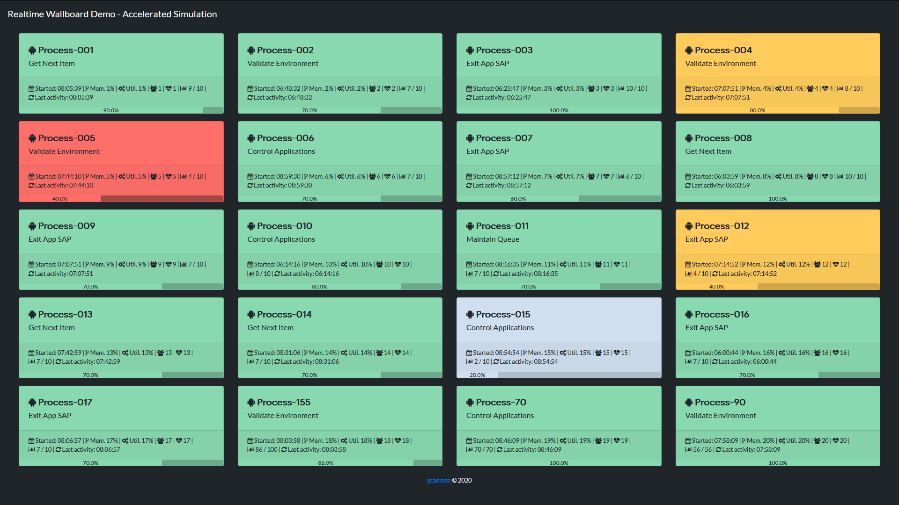

# Realtime streaming wallboard

Demonstration of a Flask based monitoring system for cloud processes running over an example accelerated day.

The goal is to track performance against SLA targets and highlight status and other pertinent information of processes on a real time basis.

The demo version is a very stripped back and limited version of the live business version deployed in Google App Engine.

